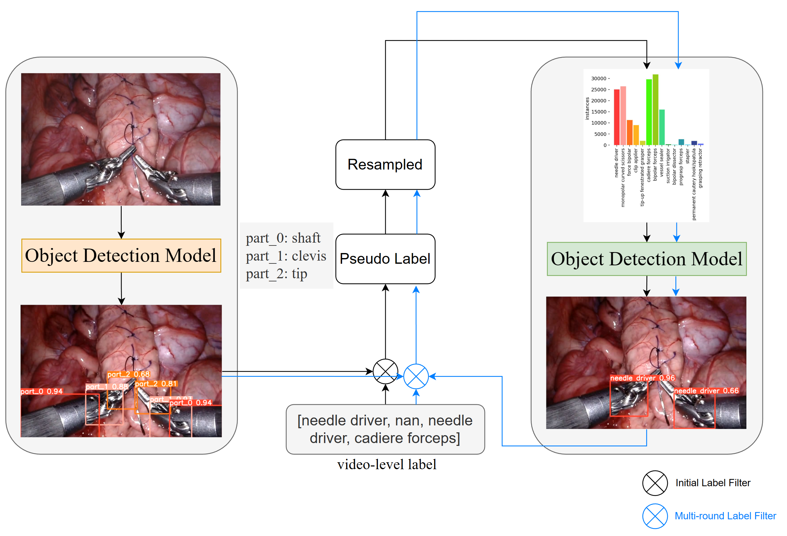

# WS-Yolo: Weakly Supervised Yolo Network for Surgical Tool Localization in Endoscopic Videos
> This repository is an officail PyTorch implementation of **WS-Yolo: Weakly Supervised Yolo Network for Surgical Tool Localization in Endoscopic Videos**.

## Overview

We proposed a Weakly Supervised Yolo Network for Surgical Tool Localization in Endoscopic Videos(WS-YOLO), which significantly diminishes the necessary human annotation labor while striking an optimal balance between the quantity of manually annotated data and detection performance. The fine-grained semantic information with location and category was generated from coarse-grained semantic information outputted bu the da Vinci surgical robot through multiple iterations.

## Requirements
This repo was forked from [YOLOv8](https://github.com/ultralytics/ultralytics). 

## Dataset
Challenge dataset: download from grand challenge.
Additional dataset: https://www.synapse.org/#!Synapse:syn47193563/files/

### Additional Dataset Preprocess:
`./simds_dataset/data_prepare.py` 将数据集划分为train和test
`./simds_dataset/get_annotation.py` 将mask转换为txt label

## Training
### Train $Det_{parts}$:
`yolo detect train data=simd_det.yaml model=yolox.pt imsz=640 epochs=1000`

### Sample video or images
`/sample_util.py`

### Predict parts use $Det_{parts}$:
`yolo detect predict model=runs/detect/train6/weights/best.pt source=../surgtooloc2022_dataset/sampled_data/ save=False save_txt=True project=regenerate_round1 name=bbox1`

### Initial Match: 
取消注释./yolo/engine/predictor.py中breezewrf部分的代码

`pseudo_label_path = "/mnt/shared/wrf/yolov8/regenerate_round1/bbox2/labels"`

`yolo detect predict model=runs/detect/train6/weights/best.pt source=../surgtooloc2022_dataset/sampled_data/ save=False save_txt=True`

注释./yolo/engine/predictor.py中breezewrf部分的代码

### Train $Det_{tools}$:
`yolo detect train data=simd_det.yaml model=yolox.pt imsz=640 epochs=1000`

### Predict tools use $Det_{tools}$:
`yolo detect predict model=runs/detect/train7/weights/best.pt source=../surgtooloc2022_dataset/sampled_data/ save=False save_txt=True project=regenerate_round2 name=bbox2`

### multi-round match
`python yolov8/regenerate_round1/match_util.py`

return to train Det_tools, bbox1 is copied from regenerated_round1

some test demo: 
`yolov8/test`

summary the classes distribution
`python ./summary.py`

## Submit
#### transfer model to submit
#### in Ubuntu desktop
`scp server:/mnt/shared/wrf/yolov8/runs/detect/train25/weights/best.pt .`
#### change the pth file name in process.py and Dockerfile
`sudo sh build.sh`

`sudo sh test.sh`
\
(never mind the Error of tmp not exist)

`sudo sh export.sh`

## Acknowledgement
+ This repo was based on [YOLOv8](https://github.com/ultralytics/ultralytics).
+ Nvidia A100s are provided by [Centre for Artificial Intelligence and Robotics (CAIR) Hong Kong Institute of Science & Innovation, Chinese Academy of Sciences](https://www.cair-cas.org.hk/).